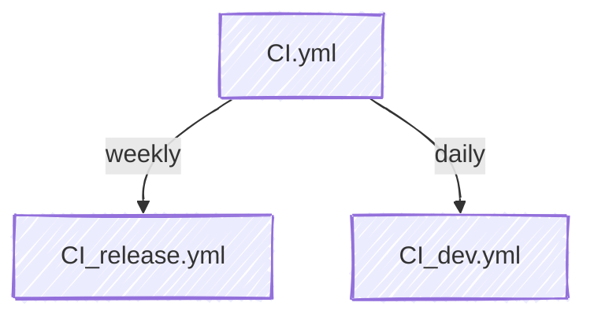

JuliaAstro.github.io
====================

[](https://juliaastro.org/)
[](https://github.com/JuliaAstro/JuliaAstro.github.io/actions/workflows/Documentation.yml)
[](https://github.com/JuliaAstro/JuliaAstro.github.io/actions/workflows/pages/pages-build-deployment)

[](https://github.com/JuliaAstro/JuliaAstro.github.io/actions/workflows/CI_release.yml)
[](https://github.com/JuliaAstro/JuliaAstro.github.io/actions/workflows/CI_dev.yml)

## Description

This repo is an in-development project to produce a landing page for JuliaAstro, inspired by the [MultiDocumenter.jl](https://github.com/JuliaComputing/MultiDocumenter.jl) workflow followed by [SciMLDocs](https://github.com/SciML/SciMLDocs) (see their production page [here](https://docs.sciml.ai/Overview/stable/)).

The rendered JuliaAstro site is published online using GitHub Pages at <https://juliaastro.org/>. A GitHub action rebuilds the site on every successful pull request.

## Contributing

Below we walk through three main ways to contribute to the JuliaAstro site:

### 1. Editing existing markdown content

Typo fixes or suggested changes to existing prose is appreciated! The most direct way to create a PR is to navigate to the page that you would like to edit, and select the "Edit source on GitHub" icon that appears at the top of each page. From there, you can submit your edits as usual following [the GitHub guide for submitting in-browser changes](https://docs.github.com/en/repositories/working-with-files/managing-files/editing-files).

### 2. Adding a package to our [Package Ecosystem page](https://juliaastro.org/home/ecosystem/) or [Comparison to Astropy page](https://juliaastro.org/home/comparison/)

Our Package Ecosystem page and Comparison page are integrated with the rest of the site, including the global navbar dropdown menu across the top, and in our [integration testing suite](https://github.com/JuliaAstro/JuliaAstro.github.io/actions/workflows/CI.yml). To add a package, include an entry in [`src/JuliaAstroDocs.jl`](https://github.com/JuliaAstro/JuliaAstro.github.io/blob/main/src/JuliaAstroDocs.jl), following the same format as the other packages. Below is an example entry of how that might look:

```julia
  (
      name = "eschnett/ASDF2.jl",
      repo = "https://github.com/eschnett/ASDF2.jl",
      doc = "https://eschnett.github.io/ASDF2.jl/dev/",
      tagline = "ASDF, the Advanced Scientific Data Format",
      descr = """
      - A new [Advanced Scientific Data Format (ASDF)](https://asdf-standard.readthedocs.io/en/latest/index.html) package, written in Julia
      """,
      astropy = ["asdf-astropy"],
  ),
```

> [!NOTE]
> The overall `ecosystem` object that this entry is stored in determines the order of the top level dropdown menus on the site (`highlevel`) and how each package appears on both pages, alphabetically by package name (`name`). Packages under the JuliaAstro organization are listed as their bare name, while packages outside of the organization have their parent repo name prepended to it, e.g., `eschnett/ASDF2.jl`

If appropriate, we appreciate a quick entry for your package in the `astropy` field that relates it to a similar package in the [Astropy ecosystem](https://www.astropy.org/). This helps new users who may be more familiar with Python get more easily oriented in the Julia ecosystem. See our [Comparison page](https://juliaastro.org/home/comparison/) for examples. If you feel that there is not a good match for your package, you can just leave the `astropy` field blank (i.e., as an empty array `[]`) and it will not appear in this page.

### 3. Adding a new entry to our [Case studies page](https://juliaastro.org/home/case_studies/)

This is a great way to showcase how packages in the JuliaAstro and wider aero/astro ecosystem are used in real world use cases. Each case study is organized in the following way within the `docs/case_studies` directory:

```julia
JuliaAstro.github.io/docs/case_studies/
├── config.json
├── exoplanets
│   ├── config.json
│   ├── <author username>-<package name>.md
│   └── sefffal-octofitter.md
├── index.md
└── ...
```

Above is an example entry in the `exoplanets` section of the case studies page, which follows the same structure recommended in the [DemoCards.jl documentation](https://democards.juliadocs.org/stable/quickstart/). To summarize:

* `index.md` is the main case-study page that all case study cards are displayed in
* The top-level `config.json` sets the card theme and order that each case study category (e.g., solar system, exoplanets, etc.) appears.
* The second-level `config.json` sets the order that each case study within a given category will appear in
* `<author username>-<package name>.md` is the main entry point to adding a new case study and follows the same naming convention used in the rest of this site. You can follow other case study markdown files in this directory (e.g., `sefffal-octofitter.md`) as a template.


All in all, to add a new case study:

1. Navigate to the appropriate case study category, e.g., `exoplanets`
1. Copy one of the existing case study markdown files, e.g., `sefffal-octofitter.md` into your own case study file following the same naming convention, i.e., `<author username>-<package>`
1. Update the content in the new file with your case study text.
1. Add an entry to `JuliaAstro.github.io/docs/case_studies/<case study category>/config.json` with your new case study filename. Note that trailing commas are not supported in the JSON spec.

## Developer documentation

### Documentation organization

<details>
  <summary>File structure</summary>

  The main portions of this documentation package are organized as follows:

  ```julia
  JuliaAstro.github.io
  ├── docs/
  │   ├── case_studies/
  │   ├── clones/
  │   ├── make.jl
  │   └── src/
  │       ├── comparison.md
  │       └──  ecosystem.md
  └── src/
      ├── comparison.jl
      ├── ecosystem.jl
      └── JuliaAstroDocs.jl
  ```

  1. All packages to document are stored in a nested NamedTuple (`ecosystem`) in `src/JuliaAstroDocs.jl`. This contains all of the metadata needed to build the rest of the site, and is the main entrypoint for making documentation contributions.
  1. Using this information, the markdown in `doc/src/` for our [comparison page](https://juliaastro.org/home/comparison/) and [ecosystem page](https://juliaastro.org/home/ecosystem/) are programatically created by `src/comparison.jl` and `src/ecosystem.jl`, respectively.
  1.  MultiDocumenter then builds the site via `docs/make.jl`, which also pulls the documentation for each JuliaAstro package and stores it in `docs/clones/`

</details>

### Running locally

Add [LiveServer.jl](https://github.com/JuliaDocs/LiveServer.jl) to your global env and then run the following in the `JuliaAstro.github.io/` folder:

```julia-repl
julia --proj=docs/

julia> using LiveServer

julia> servedocs(; include_dirs=["src/", "docs/case_studies/"], skip_files=["docs/src/comparison.md", "docs/src/ecosystem.md"], launch_browser=true)
```

The `include_dirs` arg allows our internal Revise worklow to pick up changes in `src/JuliaAstro.jl` automatically, and the `skip_files` arg keeps Documenter.jl from falling into an infinite loop as `docs/make.jl` watches for changes to our markdown files.

> [!TIP]
> If just making simple markdown changes, you can shorten the build time between edits by commenting out the call to `MultiDocumenter.make` in [`docs/make.jl`](https://github.com/JuliaAstro/JuliaAstro.github.io/blob/main/docs/make.jl). This disables the MultiDocumenter.jl repo-cloning and top navbar build process, and can be done without needing to restart your `LiveServer` session.

See our [Contributing page](https://juliaastro.org/home/#Contributing) for more.

### Testing locally

Run all tests:

```julia-repl
julia --proj

julia> ]

pkg> test
```

Run specific tests (currently  `packages_release` and `packages_dev`):

```julia-repl
julia --proj

julia> import Pkg

julia> Pkg.test("JuliaAstroDocs"; test_args=`--verbose packages_release`) # or packages_dev
```

### Continuous integration organization

We use CI to automatically re-build and deploy our documentation, and test that all JuliaAstro packages install and are compatible with each other across supported platforms and Julia versions. We accomplish this with the following GitHub action workflows:



