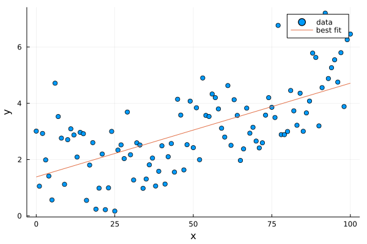
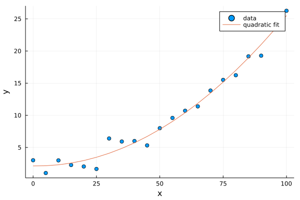

# [Curve Fitting](@id curve-fit)


This tutorial will demonstrate fitting data with a straight line (linear regression), an arbitrary non-linear model, and finally a Bayesian model.

## Packages

* [`LinearAlgebra`](https://docs.julialang.org/en/v1/stdlib/LinearAlgebra/) we'll use this built-in Julia standard library to perform a linear regression
* [`Optimization`](http://optimization.sciml.ai/stable/): we'll use this package to display coordinates along the image and add the scalebar
* `OptimizationOptimJL`: the specific optimizer backend we will use.  For your own problems, select the best backend from the Optimization.jl documentation page.
* [`Turing`](https://turing.ml/stable/): we'll use this package for Bayesian modelling.
* [`PairPlots`](https://github.com/sefffal/PairPlots.jl): we'll use this for creating a corner plot of the posterior from our Bayesian models.

You can install the necessary packages by running Julia, and typing `]` to enter Pkg-mode. Then:
```julia-repl
pkg> add Plots Optimization OptimizationOptimJL Turing PairPlots
```
Alternatively, you can run
```julia
using Pkg; Pkg.add(["Plots", "Optimization", "OptimizationOptimJL", "Turing", "PairPlots"])
```
In your own code, you most likely won't need all of these packages. Pick and choose the one that best fits your problem.

If you will be using these tools as part of a bigger project, it's strongly recommended to create a [Julia Project](https://pkgdocs.julialang.org/v1/environments/) to record package versions. If you're just experimenting, you can create a temporary project by running `] activate --temp`.

If you're using [Pluto notebooks](https://github.com/fonsp/Pluto.jl), installing and recording package versions in a project are handled for you automatically.


## Generating the data

We'll generate synthetic data for this problem. We'll make a weak parabola with some noise. For consistency, we'll seed the Julia random number generator so that we see the same noise each time the tutorial is run.

```julia-repl
julia> using Random
julia> Random.seed!(1234)
```

By calling `seed!`, the pattern of random numbers generated by `rand` and `randn` will be the same each time.

Now we'll generate the data:
```julia-repl
julia> x = 0:5:100 # Or equivalently: range(0, 100, step=5)
0:1:100

julia> y = (x ./ 20 .- 0.2).^2 .+ 2 .+ randn(length(x))
101-element Vector{Float64}:
  3.010656328855214
  1.0432815884648003
  ⋮
 25.653998582068482
 26.260043796712125

```
The `randn` function generates a random value normally distributed around `0` with a standard deviation of `1`. `rand` on the other hand creates uniformly distributed random values distributed between `0` and `1`.

Let's plot the data to see what it looks like:
```julia-repl
julia> using Plots
julia> scatter(x, y; xlabel="x", ylabel="y", label="data")
```


## Linear regression

Before using any packages, let's perform a linear fit from scratch using some linear algebra.

The equation of a line can be written in matrix form as
```math
\quad
\begin{pmatrix}
N & \sum y_i \\
\sum y_i & \sum y_{i}^2
\end{pmatrix}
\begin{pmatrix}
c_1 \\
c_2 \\
\end{pmatrix}=
\begin{pmatrix}
\sum y_i \\
\sum y_i x_i
\end{pmatrix}
```

where $c_1$ and $c_2$ are the intercept and slope.

Multiplying both sides by the inverse of the first matrix gives

```math
\quad
\begin{pmatrix}
c_1 \\
c_2 \\
\end{pmatrix}=
\begin{pmatrix}
N & \sum y_i \\
\sum y_i & \sum y_{i}^2
\end{pmatrix}^{-1}
\begin{pmatrix}
\sum y_i \\
\sum y_i x_i
\end{pmatrix}
```

We can write the right-hand side matrix and vector (let's call them `A` and `b`) in Julia notation like so:
```julia
julia> A = [
          length(x) sum(x)
          sum(x)    sum(x.^2)
      ]
2×2 Matrix{Int64}:
   21   1050
 1050  71750

julia> b = [
           sum(y)
           sum(y .* x)
       ]
2-element Vector{Float64}:
   210.4250937868108
 15023.030866331104
```

We can now perform the linear fit by solving the system of equations with the `\` operator:
```julia-repl
julia> c = A\b
2-element Vector{Float64}:
 -1.67268257376372
  0.2338585027008085
```

Let's make a helper function `linfunc` that takes an x value, a slope, and an intercept and calculates the corresponding y value:
```julia-repl
julia> linfunc(x; slope, intercept) = slope*x + intercept
linfunc (generic function with 1 method)
```

Finally, we can plot the solution:
```julia-repl
julia> yfit = linfunc.(x; slope=c[2], intercept=c[1])
julia> scatter(x, y, xlabel="x", ylabel="y", label="data")
julia> plot!(x, yfit, label="best fit")
```



The packages [LsqFit](https://julianlsolvers.github.io/LsqFit.jl/dev/) and [GLM](https://juliastats.org/GLM.jl/v0.11/#Minimal-examples-1) (for generalized linear models) contain functions for performing and evaluating these types of linear fits.

## (Non-)linear curve fit

The packages above can be used to fit different polynomial models, but if we have a truly arbitrary Julia function we would like to fit to some data we can use the [Optimization.jl](http://optimization.sciml.ai/stable/) package. Through its various backends, Optimization.jl supports a very wide range of algorithms for local, global, convex, and non-convex optimization.

The first step is to define our objective function. We'll reuse our simple `linfunc` linear function from above:
```julia
linfunc(x; slope, intercept) = slope*x + intercept

# We must supply an objective function that will be minimized
# The u argument is a vector of parameters from the optimizer.
# data is a vector of static parameters passed through below.
function objective(u, data)
    # Get our fit parameters from u
    slope, intercept = u
    # equivalent to:
    # slope = u[1]
    # intercept = u[2]

    # Get the x and y vectors from data
    x, y = data

    # Calculate the residuals between our model and the data
    residuals = linfunc.(x; slope, intercept) .- y

    # Return the sum of squares of the residuals to minimize
    return sum(residuals.^2)
end

# Define the initial parameter values for slope and intercept
u0 = [1.0, 1.0]
# Pass through the data we want to fit
data = [x,y]

# Create an OptimizationProblem object to hold the function, initial
# values, and data.
using Optimization
prob = OptimizationProblem(objective,u0,data)

# Import the optimization backend we want to use
using OptimizationOptimJL

# Minimize the function. Optimization.jl uses the SciML common solver
# interface. Pass the problem you want to solve (optimization problem
# here) and a solver to use.
# NelderMead() is a derivative-free method for finding a function's
# local minimum.
sol = solve(prob,NelderMead())

# Exctract the best-fitting parameters
slope, intercept = sol.u
```
Note: the `NelderMead()` algorithm behaves nearly identically to MATLAB's `fminsearch`.


We can now plot the solution:
```julia-repl
julia> yfit = linfunc.(x; slope, intercept)
julia> scatter(x, y, xlabel="x", ylabel="y", label="data")
julia> plot!(x, yfit, label="best fit")
```


We can now test out a quadratic fit using the same package:
```julia
function objective(u, data)
    x, y = data

    # Define an equation of a quadratic, e.g.:
    # 3x^2 + 2x + 1
    model = u[1] .* x.^2 .+ u[2] .* x .+ u[3]

    # Calculate the residuals between our model and the data
    residuals = model .- y

    # Return the sum of squares of the residuals to minimize
    return sum(residuals.^2)
end

u0 = [1.0, 1.0, 1.0]
data = [x,y]
prob = OptimizationProblem(objective,u0,data)
using OptimizationOptimJL
sol = solve(prob,NelderMead())
u = sol.u

yfit = u[1] .* x.^2 .+ u[2] .* x .+ u[3]

scatter(x, y, xlabel="x", ylabel="y", label="data")
plot!(x,  yfit, label="quadratic fit")
```




This is already very fast; however, as the scale of your problem grows, there are several routes you can take to improve the optimization performance.
First, you can use automatic differentiation and a higher order optimization algorithm:
```julia
using ForwardDiff
optf = OptimizationFunction(objective, Optimization.AutoForwardDiff())
prob = OptimizationProblem(optf,u0,data)
@time sol = solve(prob,BFGS())  # another good algorithm is Newton()
```
You can also write an "in-place" version of `objective` that doesn't allocate new arrays with each iteration.


## Bayesian models
Let's shift gears and now create a fully Bayesian model using the [Turing.jl](https://turing.ml/stable/) package.

Instead of defining an arbitrary Julia function, this package requires us to use a macro called `@model`.

Let's start with a linear model once more, now with the Turing `@model` syntax:

```julia
# Bayesian linear regression.
@model function linear_regression(x, y)
    # Set variance prior.
    σ₂ ~ truncated(Normal(0, 100), 0, Inf)
    # Typed as \sigma <tab> \_2 <tab>

    # Set intercept prior.
    intercept ~ Normal(0, 5)

    # Set the prior on our slope coefficient.
    slope ~ Normal(0, 10)

    # Each point is drawn from a gaussian (Normal) distribution
    # with mean calculated form our linear model, and standard
    # deviation as the square root of the variance variable
    for i in eachindex(x,y)
        y[i] ~ Normal(x[i] * slope + intercept, sqrt(σ₂))
    end
end

```

We can now draw posterior samples from this model using one of many available samplers, `NUTS`, the No U-Turn Sampler.

```julia
model = linear_regression(x, y)
chain = sample(model, NUTS(0.65), 500)
```
```
┌ Info: Found initial step size
└   ϵ = 0.003125
Sampling 100%|█████████████████████████████████████| Time: 0:00:05
Chains MCMC chain (25000×15×1 Array{Float64, 3}):

Iterations        = 1001:1:26000
Number of chains  = 1
Samples per chain = 25000
Wall duration     = 5.88 seconds
Compute duration  = 5.88 seconds
parameters        = σ₂, intercept, slope
internals         = lp, n_steps, is_accept, acceptance_rate, log_density, hamiltonian_energy, hamiltonian_energy_error, max_hamiltonian_energy_error, tree_depth, numerical_error, step_size, nom_step_size

Summary Statistics
  parameters      mean       std   naive_se      mcse          ess      rhat   ess_per_sec
      Symbol   Float64   Float64    Float64   Float64      Float64   Float64       Float64

          σ₂    6.7431    2.6279     0.0166    0.0265   10640.9415    1.0000     1810.6077
   intercept   -1.5979    1.0739     0.0068    0.0105   10239.7534    1.0001     1742.3436
       slope    0.2328    0.0186     0.0001    0.0002   10306.9493    1.0001     1753.7773

Quantiles
  parameters      2.5%     25.0%     50.0%     75.0%     97.5%
      Symbol   Float64   Float64   Float64   Float64   Float64

          σ₂    3.3126    4.9457    6.1965    7.9372   13.3608
   intercept   -3.6910   -2.2965   -1.5992   -0.9049    0.5423
       slope    0.1959    0.2206    0.2329    0.2449    0.2690
```


```
intercept = chain["intercept"]
slope = chain["slope"]
σ₂ = chain["σ₂"]

plot(x, x .* slope' .+ intercept';
    label="",
    color=:gray,
    alpha=0.05
)
scatter!(x, y, xlabel="x", ylabel="y", label="data", color=1)
```


Each gray curve is a sample from the posterior distribution of this model. To examine the model parameters and their covariance in greater detail, we can make a corner plot using the PairPlots.jl package. We'll need a few more samples for a nice plot, so re-run the NUTS sampler with more iterations first.
```
Random.seed!(1234)
chain = sample(model, NUTS(0.65), 25_000)

using PairPlots
table = (;
    intercept= chain["intercept"],
    slope= chain["slope"],
    σ= sqrt.(chain["σ₂"])
)
PairPlots.corner(table)
```


Let's now repeat this procedure with a Bayesian quadratic model.

```julia
@model function quad_regression(x, y)
    # Prior on the variance of the data around the best-fit line
    σ₂ ~ truncated(Normal(0, 10), 0, Inf)

    # Priors on the three quadratic parameters
    u1 ~ Normal(0,0.01)
    u2 ~ Normal(0,0.1)
    u3 ~ Normal(0,5)

    for i in eachindex(x,y)
        model = u1 * x[i]^2 + u2*x[i] + u3
        y[i] ~ Normal(model, sqrt(σ₂))
    end
end

```

We can now draw posterior samples from this model using one of many available samplers, `NUTS`, or the No U-Turn Sampler.

```julia
model = quad_regression(x, y)
chain = sample(model, NUTS(0.65), 500)
```
```
┌ Info: Found initial step size
└   ϵ = 0.0001953125
Sampling 100%|█████████████████████████████████████| Time: 0:00:05
Chains MCMC chain (500×16×1 Array{Float64, 3}):

Iterations        = 251:1:750
Number of chains  = 1
Samples per chain = 500
Wall duration     = 5.89 seconds
Compute duration  = 5.89 seconds
parameters        = σ₂, u1, u2, u3
internals         = lp, n_steps, is_accept, acceptance_rate, log_density, hamiltonian_energy, hamiltonian_energy_error, max_hamiltonian_energy_error, tree_depth, numerical_error, step_size, nom_step_size

Summary Statistics
  parameters      mean       std   naive_se      mcse        ess      rhat   ess_per_sec
      Symbol   Float64   Float64    Float64   Float64    Float64   Float64       Float64

          σ₂    1.5698    0.6322     0.0283    0.0518   117.5553    0.9994       19.9517
          u1    0.0024    0.0003     0.0000    0.0000   134.9184    0.9997       22.8986
          u2   -0.0059    0.0283     0.0013    0.0024   107.3698    0.9995       18.2230
          u3    2.1371    0.6109     0.0273    0.0562    87.2121    0.9995       14.8018

Quantiles
  parameters      2.5%     25.0%     50.0%     75.0%     97.5%
      Symbol   Float64   Float64   Float64   Float64   Float64

          σ₂    0.8757    1.1468    1.3945    1.8181    3.3834
          u1    0.0018    0.0022    0.0024    0.0026    0.0030
          u2   -0.0612   -0.0237   -0.0045    0.0133    0.0438
          u3    0.9635    1.7155    2.1211    2.5172    3.3960
```


```
u1 = chain["u1"]
u2 = chain["u2"]
u3 = chain["u3"]
posterior = u1' .* x.^2 .+ u2' .* x .+ u3'

plot(x, posterior;
    label="",
    color=:gray,
    alpha=0.1
)
scatter!(x, y, xlabel="x", ylabel="y", label="data", color=1)
```


```julia
Random.seed!(1)
chain = sample(model, NUTS(0.65), 25_000)

using PairPlots
table = (;
    u_1 = chain["u1"],
    u_2 = chain["u2"],
    u_3 = chain["u3"],
    σ= sqrt.(chain["σ₂"])
)
PairPlots.corner(table)
```

