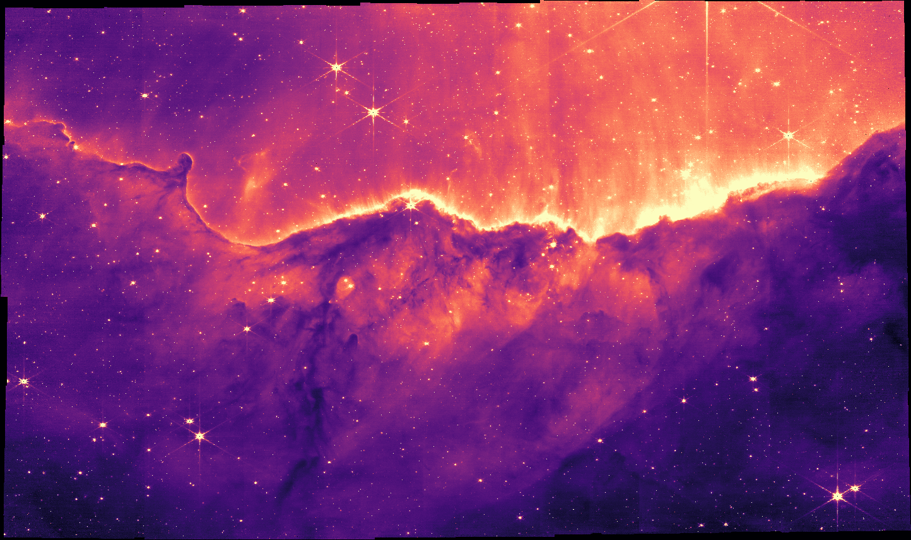
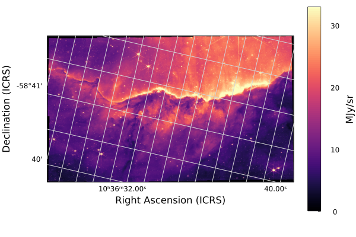
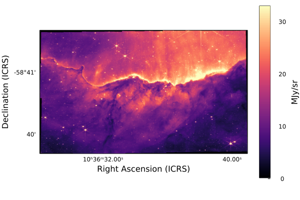
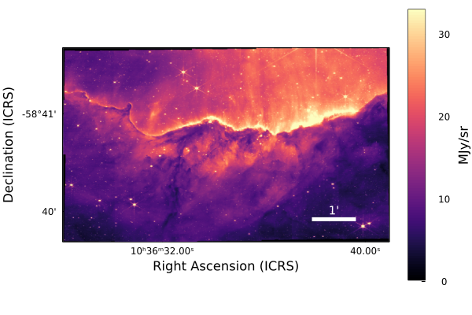

# [JWST image with scale bar](@id tutorial-jwst-scalebar)

This tutorial shows how to download one of the new famous JWST release images of the Carina nebula, plot it with world coordinates (RA and DEC), and add a scalebar.
Let's get started!

## Packages

* [`Downloads`](https://docs.julialang.org/en/v1/stdlib/Downloads/): we'll use this built-in Julia standard library to download the raw image data
* [`AstroImages`](http://juliaastro.org/AstroImages/stable/): we'll use this package to load and display the image
* [`Plots`](https://docs.juliaplots.org/stable/): we'll use this package to display coordinates along the image and add the scalebar

You can install the necessary packages by running Julia, and typing `]` to enter Pkg-mode. Then:
```julia-repl
pkg> add AstroImages Plots
```
Alternatively, you can run
```julia
using Pkg; Pkg.add(["AstroImages", "Plots"])
```

If you will be using these tools as part of a bigger project, it's strongly recommended to create a [Julia Project](https://pkgdocs.julialang.org/v1/environments/) to record package versions.  If you're just experimenting, you can create a temporary project by running
```julia-repl
pkg> activate --temp
```

If you're using [Pluto notebooks](https://github.com/fonsp/Pluto.jl), installing and recording package versions in a project are handled for you automatically.


## Downloading the data

All JWST data is available from the [MAST archive](https://mast.stsci.edu/portal/Mashup/Clients/Mast/Portal.html).

A mirror of the JWST initial release data is also hosted on AWS. We'll use this to directly download a specific famous image by URL.

!!! warning "Large Download"
    The size of this image is over 3GB! Ensure you have enough space on your hard drive before running the following code.


```julia
using Downloads

fname = Downloads.download(
   "https://stpubdata-jwst.stsci.edu/ero/jw02731/L3/t/"*
   "jw02731-o001_t017_nircam_clear-f187n_i2d.fits"
)
```

## Loading the image
We can use [`AstroImages.jl`](http://juliaastro.org/AstroImages/stable/) to load the image.

```julia
using AstroImages

carina_full = load(fname); # semi-colon prevents displaying the image
```
```
[ Info: Image was loaded from HDU 2
```

Let's check the resolution of the image:
```julia
size(carina)
```
```
(14436, 8568)
```
Wow, that's over 120 megapixels!

AstroImages will fall back to downscaling it automatically before displaying it using [`ImageTransformations.restrict`](https://juliaimages.org/stable/function_reference/#ImageTransformations.restrict), but let's make our lives simpler and just use every 10th pixel:

```julia
carina = carina_full[begin:10:end, begin:10:end]
```


Since we didn't put a semi-colon, the image was displayed. This works automatically if you use the VS Code editor, Jupyter notebooks, or Pluto Notebooks. If you're using a terminal, you can use [ElectronDisplay.jl](https://github.com/queryverse/ElectronDisplay.jl) or [ImageView.jl](https://github.com/JuliaImages/ImageView.jl) to open an interactive window.

[`AstroImages.imview`](@extref) is the function that was called automatically  to display the image, but we can call it ourselves if we want to customize the display.
We can make the image pop a little more by adjusting the display limits, or `clims`. These can be either a tuple of min and max values (i.e. `(0.0, 100.0)`) or a function to calculate them for us based on some criteria. We'll adjust the limits to remove the top and bottom 1% of all  pixels:

```julia
imview(carina; clims=Percent(98))
```



In Julia, [keyword arguments](https://docs.julialang.org/en/v1/manual/functions/#Keyword-Arguments) come after positional arguments and they can be separated by a semi-colon.


## Adding World Coordinates
The image header already contains WCS keys to specify the location of the image in the sky. Let's take a peek at one of these header keys:

```julia
println(carina["CTYPE1", Comment])
println(carina["CTYPE1"])
```
```
first axis coordinate type
RA---TAN
```

This shows that the coordinate type for the first axis is "RA---TAN".

Now, we'll combine AstroImages with the [Plots.jl](https://docs.juliaplots.org/stable/) library to display these coordinates.


```julia
using Plots

implot(carina; clims=Percent(98))
```



The image is tilted compared to the right-ascension and declination celestial coordinate system, so the grid is rotated.

The colourbar on the right displays the units of the image: Mega-Janskys per steradian: units of energy per collecting area, per spectral bandwidth, per solid-angle on the sky.

Let's turn off the grid for now:
```julia
implot(carina; grid=false, clims=Percent(98))
```



See [`AstroImages.implot`](@extref) for full documentation.

## Adding a Scalebar

Another way we can communicate the scale of this image is by adding a scalebar. Since we are working in spherical coordinates, the cartesian Pythagorean theorem won't quite cut it. There are approximations we can use for small angles, but let's go ahead and compute the scale bar length in a fully general way.

For two points of right-ascension $\alpha$ and declination $\delta$, $a=(\alpha_a, \delta_a)$ and $b=(\alpha_b, \delta_b)$, the angular separation is
```math
\cos (\gamma) = \cos (90° - \delta_a) \cos (90° - \delta_b) + \sin (90° - \delta_a) \sin (90° - \delta_b) \cos (\alpha_a - \alpha_b)
```

We can calculate the length of our scalebar in pixels by picking a coordinate $a$, picking an angular separation $\gamma$, and then solving for $b$:


```julia
using LinearAlgebra

# Start the scalebar here in pixel coordinates
a_px = [1000, 100]

# Convert to world coordinates
a_deg = pix_to_world(carina_full, a_px)

# Extend by 10 arcminutes of declination
b_deg  = a_deg .+ [0, 1/60]

# Convert back to pixel coordinates
b_px = world_to_pix(carina_full, b_deg)

# Measure the angular distance in pixel coordinates
# note: in theory this depends on where in the image we make this calculation
# because the coordinate system is warped
arcmin_px = norm(stop_coord_pix .- start_coord_pix)

# Plot our image again
implot(carina; grid=false, clims=Percent(98))

# Overplot the scalebar
plot!(
    # X
    [11000, 11000+arcmin_px],
    # Y
    [1000,  1000];
    # Formatting:
    color=:white,
    linewidth=5,
    label=""
)

# add annotation
annx = 11000+arcmin_px/2
anny = 1000+100
annotate!(
    (annx, anny, text(" 1' ", 10, :white, :center, :bottom))
)
```



Looking good! If we only want to communiate the scale and not the location, we can hide the tick marks and colorbar for a cleaner look:
```julia

# Hide decorations
implot(
    carina[10:end-10, 10:end-10]; # crop slightly
    grid=false,
    ticks=false,
    colorbar=false,
    clims=Percent(98),
    xlabel="",
    ylabel="",
    framestyle=:none,
    background_outside=:transparent,
)

# Overplot the scalebar
plot!(
    # X
    [11000, 11000+arcmin_px],
    # Y
    [1000,  1000];
    # Formatting:
    color=:white,
    linewidth=5,
    label="",
)

# add annotation
annx = 11000+arcmin_px/2
anny = 1000+100
annotate!(
    (annx, anny, text(" 1' ", 10, :white, :center, :bottom))
)
```


To save the image, just run `savefig("output.png")`. `pdf`, `svg`, and other file formats are also supported.

To learn more about displaying images and world coordinates, see the [AstroImages.jl documentation](http://juliaastro.org/AstroImages/stable/).

For more on plotting in general, see the [Plots.jl documentation](https://docs.juliaplots.org/stable/).
