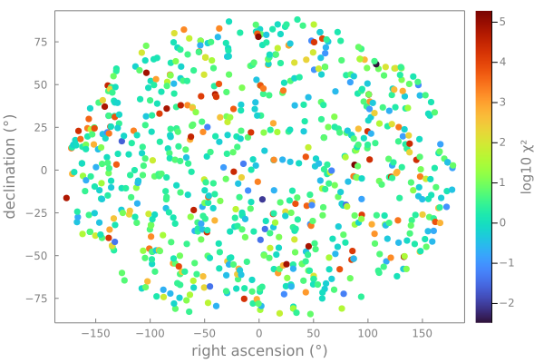

# [Working with tabular data](@id tabular-data)

Tables are a common way to represent various forms of catalogs. One common format for storing this data in astronomy is as a FITS file.

In these examples, we will fetch and load the Hipparcos-GAIA Catalog of Accelerations [(HGCA, Brandt et al 2021)](https://iopscience.iop.org/article/10.3847/1538-4365/abf93c).
This catalog cross matches stars from the Hipparcos and GAIA catalogs in order to calculate the long term astrometric proper motion anomaly; that is, the star's deviation from straight line motion in the plane of the sky over the ~20 baseline between the two missions.

A wide range of tabular data formats are supported in Julia under a common [Tables.jl interface](https://tables.juliadata.org). For example, 
[CSV](https://github.com/JuliaData/CSV.jl.git), [Excel](https://github.com/felipenoris/XLSX.jl.git), [Arrow](https://github.com/apache/arrow-julia), [CASA Tables](http://mweastwood.info/CasaCore.jl/stable/), and various SQL formats to name a few.


## Packages

* [`FITSIO`](http://juliaastro.org/FITSIO/stable/): we'll use this package to load a table stored in a FITS file
* [`DataFrames`](https://dataframes.juliadata.org/stable/): we'll use this package to examine and manipulate the table
* [`Plots`](https://docs.juliaplots.org/stable/): we'll use this package to visualize the contents of the table
* [`AstroLib`](https://juliaastro.org/AstroLib/stable/): general utility package. We'll use a helper function to compute a map projection.

You can install the necessary packages by running Julia, and typing `]` to enter Pkg-mode. Then:
```julia-repl
pkg> add FITSIO DataFrames Plots AstroLib
```
Alternatively, you can run
```julia
using Pkg; Pkg.add(["FITSIO", "DataFrames", "Plots", "AstroLib"])
```

If you will be using these tools as part of a larger project, it's strongly recommended to create a [Julia Project](https://pkgdocs.julialang.org/v1/environments/) to record package versions.  If you're just experimenting, you can create a temporary project by running `] activate --temp`.

If you're using [Pluto notebooks](https://github.com/fonsp/Pluto.jl), installing and recording package versions in a project are handled for you automatically.


## Downloading the data

The table in question is hosted alongside the [article](https://iopscience.iop.org/article/10.3847/1538-4365/abf93c). Go to Table 4 and click the link at the bottom to download it in FITS format. You'll need to uncompress the archive to see the `HGCA_vEDR3.fits` file.

FITS tables can be loaded using the [FITSIO](http://juliaastro.org/FITSIO/stable/) package or the [AstroImages](http://juliaastro.org/AstroImages/stable/) package which wraps it.


## Loading the table

```julia-repl
julia> using FITSIO
julia> fits = FITS("HGCA_vEDR3.fits")

File: HGCA_vEDR3.fits
Mode: "r" (read-only)
HDUs: Num  Name  Type
      1          Image
      2          Table
julia> table_fits = fits[2]
File: HGCA_vEDR3.fits
HDU: 2
Type: Table
Rows: 115346
Columns: Name                    Size  Type     TFORM
         hip_id                        Int32    J
         gaia_source_id                Int64    K
         gaia_ra                       Float64  D
         gaia_dec                      Float64  D
         radial_velocity               Float32  E
...
         chisq                         Float32  E
```

If we choose to use the AstroImages package, this code could be substituted for:
```julia-repl
julia> using AstroImages
julia> table_fits = load("HGCA_vEDR3.fits", 2);
```

Since this table conforms to the Tables.jl interface we can already pass it to a wide range of analysis and plotting tools; however, for interactive work it's useful to wrap this data in a `DataFrame` from [DataFrames.jl](https://dataframes.juliadata.org/stable/).

```julia-repl
julia> using DataFrames
julia> df = DataFrame(table_fits)
115346×35 DataFrame
    Row │ hip_id  gaia_source_id       gaia_ra        gaia_dec ⋯
        │ Int32   Int64                Float64        Float64  ⋯
────────┼───────────────────────────────────────────────────────
      1 │      1  2738327528519591936    0.000871957    1.0889 ⋯
      2 │      2  2341871673090078592    0.00511158   -19.4988
      3 │      3  2881742980523997824    0.00506023    38.8593
      4 │      4  4973386040722654336    0.00907157   -51.8935
      5 │      5  2305974989264598272    0.00997423   -40.5912 ⋯
   ⋮    │   ⋮              ⋮                 ⋮            ⋮    ⋱
 115343 │ 120401  5290738562888564736  119.382        -60.6309
 115344 │ 120402  5290832364972775808  119.449        -60.6097
 115345 │ 120403  5290725643625189504  119.455        -60.6836
 115346 │ 120404  5290820682661822848  119.512        -60.6147 ⋯
                              32 columns and 115337 rows omitted

```


## Examining the table

As a first step, let's summarize the contents of the data frame using `describe`:

```julia-repl
julia> describe(df)
35×7 DataFrame
 Row │ variable                mean         min            median       max                  nmissing  eltype
     │ Symbol                  Union…       Any            Union…       Any                  Int64     DataType
─────┼──────────────────────────────────────────────────────────────────────────────────────────────────────────
   1 │ hip_id                  59162.8      1              59133.5      120404                      0  Int32
   2 │ gaia_source_id          3.5587e18    7632157690368  3.58418e18   6917489002841762304         0  Int64
   3 │ gaia_ra                 181.445      0.000871957    181.843      359.982                     0  Float64
   4 │ gaia_dec                -2.13495     -89.7824       -1.96568     89.5695                     0  Float64
   5 │ radial_velocity         NaN          NaN                         NaN                         0  Float32
   6 │ radial_velocity_error   NaN          NaN                         NaN                         0  Float32
   7 │ radial_velocity_source               Gaia_DR2                    None                        0  String
   8 │ parallax_gaia           6.98091      0.1            4.29612      768.067                     0  Float32
   9 │ parallax_gaia_error     0.0450278    0.00802848     0.023354     1.52339                     0  Float32
  10 │ pmra_gaia               -1.43563     -4406.47       -1.73408     6766.0                      0  Float32
  11 │ pmdec_gaia              -16.3946     -5817.8        -5.53577     10362.4                     0  Float32
  12 │ pmra_gaia_error         0.062217     0.00743185     0.0326008    2.03418                     0  Float32
  13 │ pmdec_gaia_error        0.0574897    0.00869586     0.029098     1.99573                     0  Float32
  14 │ pmra_pmdec_gaia         -0.0142746   -0.971819      -0.0116653   0.891564                    0  Float32
  15 │ pmra_hg                 -1.43057     -4406.68       -1.69382     6765.91                     0  Float32
  ⋮  │           ⋮                  ⋮             ⋮             ⋮                ⋮              ⋮         ⋮
  22 │ pmra_hip_error          1.22346      0.290212       0.93546      2269.23                     0  Float32
  23 │ pmdec_hip_error         1.00177      0.289527       0.794942     113.61                      0  Float32
  24 │ pmra_pmdec_hip          0.00441718   -0.94068       0.000400515  0.986897                    0  Float32
  25 │ epoch_ra_gaia           2016.07      2015.11        2016.07      2017.05                     0  Float64
  26 │ epoch_dec_gaia          2016.09      2014.95        2016.1       2017.2                      0  Float64
  27 │ epoch_ra_hip            1991.25      1990.4         1991.25      1992.43                     0  Float64
  28 │ epoch_dec_hip           1991.28      1990.34        1991.28      1992.41                     0  Float64
  29 │ crosscal_pmra_hip       -0.0578266   -1.36874       -0.0648208   1.50959                     0  Float32
  30 │ crosscal_pmdec_hip      0.00226569   -1.15742       0.00306844   1.59232                     0  Float32
  31 │ crosscal_pmra_hg        -0.0013262   -0.0511373     -0.00269026  0.0619938                   0  Float32
  32 │ crosscal_pmdec_hg       0.000217839  -0.0598967     0.00025581   0.0564424                   0  Float32
  33 │ nonlinear_dpmra         -9.0424e-5   -7.98001       3.44128e-8   2.64822                     0  Float32
  34 │ nonlinear_dpmdec        0.000311498  -4.1194        1.92019e-7   16.0394                     0  Float32
  35 │ chisq                   566.555      3.11559e-5     3.35103      3.67633e5                   0  Float32
                                                                                                  6 rows omitted

```


This lists all the columns of the table along with their min, max, median, and means. It also specifies how many entries are [`missing`](https://docs.julialang.org/en/v1/manual/missing/) and the element type of the column.

We can access a specific column from the table using two different syntaxes: `df[:,"epoch_ra_gaia"]`, or simply `df.epoch_ra_gaia`.

## Filtering

Let's apply a cut to the parallax column to only include nearby stars:

```julia-repl
julia> nearby = filter(:parallax_gaia => >(50.0), df)
799×35 DataFrame
 Row │ hip_id  gaia_source_id       gaia_ra    gaia_dec   radial_velocity  radial_vel ⋯
     │ Int32   Int64                Float64    Float64    Float32          Float32    ⋯
─────┼─────────────────────────────────────────────────────────────────────────────────
   1 │    428   386655019234959872    1.30108   45.7859          -1.24273             ⋯
   2 │    436  4706630501049679744    1.32232  -67.8351          40.2364
   3 │    439  2306965202564744064    1.38379  -37.3675          25.2944
   4 │    473   386653851004022144    1.42676   45.8114           1.15092
  ⋮  │   ⋮              ⋮               ⋮          ⋮             ⋮                    ⋱
 796 │ 117779  2867175035571212416  358.285     29.0182           1.30031             ⋯
 797 │ 117828  6377828354964753792  358.463    -75.6342          -9.62612
 798 │ 117966  2442996678074668288  358.914     -6.14423         17.0672
 799 │ 120005  1022456104850892928  138.591     52.6834          11.9794
                                                        30 columns and 791 rows omitted
```

Let's break this down. First, we specify the column name as `:parallax_gaia`. The `:` syntax defines a Symbol in Julia which is a bit like a string and a variable name. Next, we say what filter we want to apply to this column by passing a key-value `Pair` constructed with `=>`. This syntax, e.g. `1 => 2` just groups two values and is unrelated to keyword arguments. Then, we pass a predicate function, that is a function that takes one value and returns `true` or `false`. The expression `>(50.0)` produces such a function that takes a value and compares it with `50.0` milliarcseconds of parallax. Finally, we pass the table we want to filter.


This [useful cheatsheet](https://www.ahsmart.com/pub/data-wrangling-with-data-frames-jl-cheat-sheet/) by Tom Kwong is a great reference for these sort of operations.


## Plotting

Let's now visualize these stars as they appear in the plane of the sky. We'll colour them based on the significance of the anomalous acceleration they had between the two satellite missions. This acceleration could be caused by a hidden companion star or planet.


```julia-repl
julia> using Plots
julia> scatter(
    nearby.gaia_ra,
    nearby.gaia_dec;
    marker_z = log10.(nearby.chisq),
    colorbartitle="log10 χ²", # typed as \chi <tab> \^2 <tab>
    label = "",
    xlabel = "right ascension (°)", # typed as \degree <tab>
    ylabel = "declination (°)",
)
```

Let's improve this plot by using a different map projection. We can make this conversion using [AstroLib.jl](https://juliaastro.org/AstroLib/stable/).

The function [`AstroLib.aitoff`](@extref) takes longitude and latitude (or in this case, right-ascension and declination) and returns a new position using an Aitoff projection.

```julia-repl
julia> using AstroLib
julia> newpoints = aitoff.(nearby.gaia_ra, nearby.gaia_dec)
```

`newpoints` is returned as a vector of `Tuples` of x and y coordinates, but to plot them we'll need separate flat vectors of x and y values. We can convert using `getindex`:
```julia-repl
julia> newx = getindex.(newpoints, 1)
julia> newy = getindex.(newpoints, 2)
799-element Vector{Float64}:
  49.51360693576993
 -71.02232113037604
 -40.77386766281466
   ⋮
 -78.04105630927837
  -6.821326623255115
  64.9538084311332
```
`getindex(obj, n)` is equivalent to writing `obj[n]`. Here we use broadcasting to fetch the first and then second element of each point in the list.

Finally, we'll make the plot and tweak some formatting options:

```julia-repl
julia> scatter(
    newx,
    newy;
    marker_z = log10.(nearby.chisq),
    color = :turbo,
    colorbartitle="log10 χ²", # typed as \chi <tab> \^2 <tab>
    label = "",
    xlabel = "right ascension (°)", # typed as \degree <tab>
    ylabel = "declination (°)",
    background=:transparent,
    foreground=:gray,
    framestyle=:box,
    markerstrokewidth=0,
    grid=:none
)
```


We can save the plot using `savefig("myplot.pdf")`. `png`, `svg`, and other formats are also supported.


For more on plotting in general, see the [Plots.jl documentation](https://docs.juliaplots.org/stable/).
