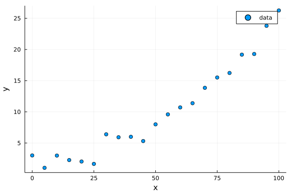
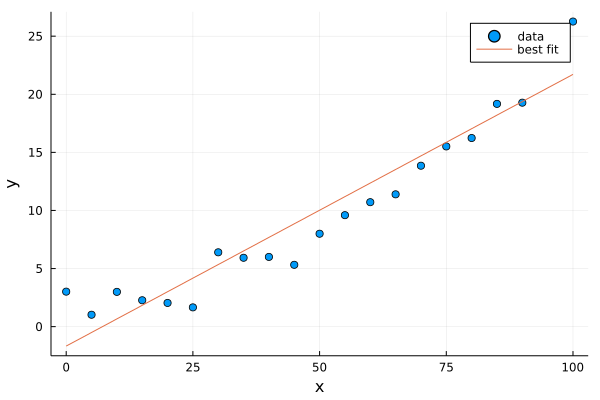

# [Curve Fitting](@id curve-fit)


This tutorial will demonstrate fitting data with a straight line (linear regression), an abitrary non-linear model, and finally a Bayesian model.

## Packages we'll need

* [`LinearAlgebra`](https://docs.julialang.org/en/v1/stdlib/LinearAlgebra/) we'll use this built-in Julia standard library to perform a linear regression
* [`Optimization`](http://optimization.sciml.ai/stable/): We'll use this package to display coordinates along the image and add the scalebar
* `OptimizationOptimJL`: the specific optimizer backend we will use.  For your own problems, select the best backend from the Optimization.jl documentation page.
* [`Turing`](https://turing.ml/stable/): We'll use this package for Bayesian modelling.
* [`PairPlots`](https://github.com/sefffal/PairPlots.jl): We'll use this for creating a corner plot of the posterior from our Bayesian models.

You can install the necessary packages by running Julia, and typing `]` to enter Pkg-mode. Then: `add Plots Optimization OptimizationOptimJL Turing PairPlots`.
Alternatively, you can run `using Pkg; Pkg.add(["Plots", "Optimization", "OptimizationOptimJL", "Turing", "PairPlots"])`.
In your own code, you most likely won't need all of these packages. Pick and choose the one that best fits your problem.

If you will be using these tools as part of a bigger project, it's strongly recommended to create a [Julia Project](https://pkgdocs.julialang.org/v1/environments/) to record package versions. If you're just experimenting, you can create a temporary project by running `] activate --temp`.

If you're using [Pluto notebooks](https://github.com/fonsp/Pluto.jl), installing and recording package versions in a project are handled for you automatically.


## Generating the data

We'll generate synthetic data for this problem. We'll make a weak parabola with some noise. For consitenty, we'll seed the Julia random number generator so that we see the same noise each time the tutorial is run.

```julia-repl
julia> using Random
julia> Random.seed!(1234)
```

No we'll generate the data:
```julia-repl
julia> x = 0:1:100 # Or equivalently: range(0, 100, step=1)
0:1:100

julia> y = (x ./ 50 .- 0.2).^2 .+ 2 .+ randn(length(x))
```
The `randn` function generates a random value normally distributed around `0` with a standard deviation of `1`. `rand` on the other hand creates uniformly distributed random values distributed between `0` and `1`.

Let's plot the data to see what it looks like:
```julia-repl
julia> using Plots
julia> scatter(x, y, xlabel="x", ylabel="y", label="data")
```




## Linear regression

Before using any packages, let's perform a linear fit from scratch using some linear algebra.

The equation of a line can be written in matrix form as 
```math
\quad
\begin{pmatrix} 
N & \sum y_i \\
\sum y_i & \sum y_{i}^2
\end{pmatrix}
\begin{pmatrix}
c_1 \\
c_2 \\
\end{pmatrix}=
\begin{pmatrix}
\sum y_i \\
\sum y_i x_i
\end{pmatrix}
```

where $c_1$ and $c_2$ are the intercept and slope.

Multiplying both sides by the inverse of the first matrix gives

```math
\quad
\begin{pmatrix}
c_1 \\
c_2 \\
\end{pmatrix}=
\begin{pmatrix} 
N & \sum y_i \\
\sum y_i & \sum y_{i}^2
\end{pmatrix}^{-1}
\begin{pmatrix}
\sum y_i \\
\sum y_i x_i
\end{pmatrix}
```

We can write the right-hand side matrix and vector (let's call them `A` and `b`) in Julia notation like so:
```julia
julia> A = [
          length(x) sum(x)
          sum(x)    sum(x.^2)
      ]
2×2 Matrix{Int64}:
  101    5050
 5050  338350

julia> b = [
           sum(y)
           sum(y .* x)                                          
       ]
2-element Vector{Float64}:
   307.83470027654454
 18252.767559901687
```

We can now perform the linear fit by solving the system of equations with the `\` operator:
```julia-repl
julia> c = A\b
2-element Vector{Float64}:
 1.3815709718269056
 0.03332594695485685

```

 Let's make a helper function `linfunc` that takes an x value, a slope, and an intercept and calculated the corresponding y value:
```julia-repl
julia> linfunc(x; slope, intercept) = slope*x + intercept
linfunc (generic function with 1 method)

```

Finally, we can plot the solution:
```julia-repl
julia> scatter(x, y, xlabel="x", ylabel="y", label="data")
julia> plot!(x, linfunc.(x; slope=c[2], intercept=c[1]), label="best fit")
```


The package [LsqFit](https://julianlsolvers.github.io/LsqFit.jl/latest/) contains helper functions for performing these types of fits and evaluating their goodness of fit.

## (Non-)linear curve fit

We can fit a general function to data using the [Optimization.jl](http://optimization.sciml.ai/stable/) package. Through its various backends, Optimization.jl supports a very wide range of algorithms for local, global, convex, and non-convex optimization. 

The first step is to define our objective function. We'll reuse our simple `linfunc` linear function from above:
```julia
linfunc(x; slope, intercept) = slope*x + intercept

using Optimization
function objective(u, data)
    slope, intercept = u
    x, y = data
    
    residuals = linfunc.(x; slope, intercept) .- y
    return sum(residuals.^2)
end

u0 = [1.0, 1.0]
data = [x,y]

prob = OptimizationProblem(objective,u0,data)

using OptimizationOptimJL
@time sol = solve(prob,NelderMead())

slope, intercept = sol.u
```
Note: the `NelderMeade()` algorithm behaves nearly identically to MATLAB's `fminsearch`. 


We can now plot the solution:
```julia-repl
julia> scatter(x, y, xlabel="x", ylabel="y", label="data")
julia> plot!(x, linfunc.(x; slope, intercept), label="best fit")
```


We can now test out a quadratic fit using the same package:
```julia
function objective(u, data)
    x, y = data
    
    model = u[1] .* (x*u[2] .+ u[3]).^2 .+ u[4] .* (x .+ u[5])
    residuals = model .- y
    return sum(residuals.^2)
end

u0 = [1.0, 1.0, 1.0, 1.0, 1.0]
data = [x,y]

prob = OptimizationProblem(objective,u0,data)

using OptimizationOptimJL
@time sol = solve(prob,NelderMead())
u = sol.u
scatter(x, y, xlabel="x", ylabel="y", label="data")
plot!(x,  u[1] .* (x*u[2] .+ u[3]).^2 .+ u[4] .* (x .+ u[5]), label="quadratic fit")
```


This is already very fast; however, as the scale of your problem grows, there are several routes you can take to improve the optimization performance.
First, you can use automatic differentiation and a higher order optimization algorithm:
```julia
using ForwardDiff
optf = OptimizationFunction(objective, Optimization.AutoForwardDiff())
prob = OptimizationProblem(optf,u0,data)
@time sol = solve(prob,BFGS())  # another good algorithm is Newton()
```
You can also write an "in-place" version of `objective` that doesn't allocate new arrays with each iteration.


## Bayesian models
Let's shift gears and now create a fully Bayesian model using the [Turing.jl](https://turing.ml/stable/) package.

Instead of defining an arbitrary Julia function, this package requires us to use a macro called `@model`.

Let's start with a linear model once, now with the Turing `@model` syntax:

```julia
# Bayesian linear regression.
@model function linear_regression(x, y)
    # Set variance prior.
    σ₂ ~ truncated(Normal(0, 100), 0, Inf)
    # Typed as \sigma <tab> \_2 <tab>

    # Set intercept prior.
    intercept ~ Normal(0, sqrt(3))

    # Set the prior on our slope coefficient.
    slope ~ Normal(sqrt(10))

    # Each point is drawn from a gaussian (Normal) distribution
    # with mean calculated form our linear model, and standard deviation as the square root of the variance variable
    for i in eachindex(x,y)
        y[i] ~ Normal(x[i] * slope + intercept, sqrt(σ₂))
    end
end

```

We can now draw posterior samples from this model using one of many available samplers, `NUTS`, or the No U-Turn Sampler.

```julia
model = linear_regression(x, y)
chain = sample(model, NUTS(0.65), 500)
```

```
intercept = chain["intercept"]
slope = chain["slope"]
σ₂ = chain["σ₂"]

scatter(x, y, xlabel="x", ylabel="y", label="data")
plot!(x, x .* slope' .+ intercept';
    label="",
    color=:gray,
    alpha=0.1
)
```


Each gray curve is a sample from the posterior distribution of this model. To examine the model parameters and their covariance in greater detail, we can make a corner plot using the PairPlots.jl package. We'll need a few more samples for a nice plot, so re-run the NUTS sampler with more iterations first.
```
Random.seed!(1234)
chain = sample(model, NUTS(0.65), 25_000)

using PairPlots
table = (;
    intercept= chain["intercept"],
    slope= chain["slope"],
    σ= sqrt.(chain["σ₂"])
)
PairPlots.corner(table)
```


Let's now repeat this proceedure with a Bayesian quadratic model.

```julia
@model function quad_regression(x, y)
    σ₂ ~ truncated(Normal(0, 100), 0, Inf)
    u1 ~ Normal(5)
    u2 ~ Normal(5)
    u3 ~ Normal(5)
    u4 ~ Normal(5)
    u5 ~ Normal(5)

    # Calculate all the mu terms.
    for i in eachindex(x,y)
        model = u1 * (x[i]*u2 + u3)^2 + u4 * (x[i] + u5)
        y[i] ~ Normal(model, sqrt(σ₂))
    end
end

```

We can now draw posterior samples from this model using one of many available samplers, `NUTS`, or the No U-Turn Sampler.

```julia
model = quad_regression(x, y)
chain = sample(model, NUTS(0.65), 500)
```

```
u1 = chain["u1"]
u2 = chain["u2"]
u3 = chain["u3"]
u4 = chain["u4"]
u5 = chain["u5"]
posterior = u1' .* (x.*u2' .+ u3').^2 .+ u4' .* (x .+ u5')

scatter(x, y, xlabel="x", ylabel="y", label="data")
plot!(x, posterior;
    label="",
    color=:gray,
    alpha=0.1
)
```

